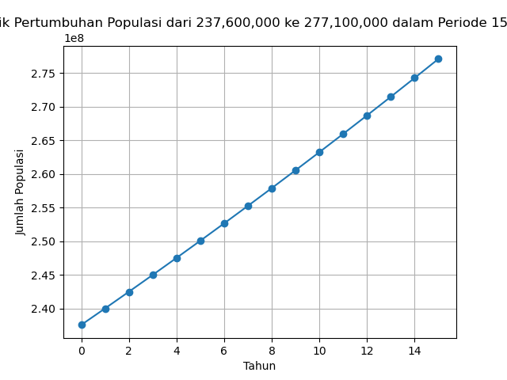

# Population Growth Simulator

Program ini menghitung dan memvisualisasikan **pertumbuhan jumlah penduduk** dalam jangka waktu tertentu menggunakan **model pertumbuhan eksponensial**.

## Deskripsi
Rumus pertumbuhan penduduk yang digunakan adalah:

**P(t) = P₀ · exp(r · t)**

- **P₀** : jumlah penduduk awal  
- **P(t)** : jumlah penduduk setelah t tahun  
- **r** : laju pertumbuhan tahunan  
- **t** : waktu dalam tahun  

Program ini juga dapat menghitung **laju pertumbuhan** r jika jumlah penduduk awal, akhir, dan jumlah tahun diketahui:

**r = (1/t) · ln(Pt / P0)**

## Cara Menggunakan
1. Jalankan program `src/pertumbuhan_penduduk.py`.
2. Masukkan jumlah penduduk awal (`P0`).
3. Masukkan jumlah penduduk setelah beberapa tahun (`Pt`).
4. Masukkan jumlah tahun yang telah lewat (`t`).
5. Program akan menampilkan:
   - Laju pertumbuhan tahunan
   - Jumlah penduduk tiap tahun
   - Grafik pertumbuhan populasi

## Contoh Output


Gambar menampilkan perkiraan laju pertumbuhan dalam periode 15 tahun di Indonesia (2010-2025) dengan jumlah penduduk awal **P0 = 237.6 juta** dan penduduk setelah 15 tahun **Pt = 277.1 juta** dan jumlah penduduk random

Status: Tahap pengembangan (v1.0)

## v2.0
- Pengalihan dari *input()* ke *argparse*
- Membagi program ke 4 modular

## Cara menggunakan:
jalankan command *python src/main.py --tahun (n) --P0 (n) --Pt (n) --mode (n)*

dengan:
--tahun : jumlah tahun (int)

--P0 : populasi awal (int)

--Pt : populasi akhir (int)

--mode : pilih output

1 → Grafik saja

2 → Simpan data (CSV + JSON)

3 → Keduanya (default)


## v3.0
## Testing

Project ini sudah dilengkapi dengan unit test menggunakan **pytest**.  
Tujuan test adalah memastikan fungsi perhitungan, penyimpanan data, dan plotting berjalan sesuai harapan.

## Menjalankan Test
```bash
pytest -v
Cakupan
Calculator → hitung laju & populasi

IO Handler → simpan CSV & JSON

Plotter → generate grafik PNG
(Penambahan testing untuk memastikan program berjalan sesuai harapan)

