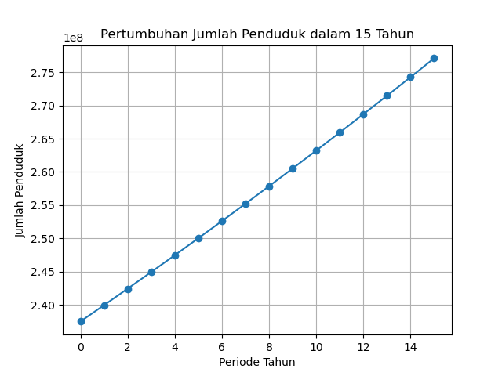

# Population Growth Simulator

Program ini menghitung dan memvisualisasikan **pertumbuhan jumlah penduduk** dalam jangka waktu tertentu menggunakan **model pertumbuhan eksponensial**.

## Deskripsi
Rumus pertumbuhan penduduk yang digunakan adalah:

**P(t) = P₀ · exp(r · t)**

- **P₀** : jumlah penduduk awal  
- **P(t)** : jumlah penduduk setelah t tahun  
- **r** : laju pertumbuhan tahunan  
- **t** : waktu dalam tahun  

Program ini juga dapat menghitung **laju pertumbuhan** r jika jumlah penduduk awal, akhir, dan jumlah tahun diketahui:

**r = (1/t) · ln(Pt / P0)**

## Cara Menggunakan
1. Jalankan program `src/pertumbuhan_penduduk.py`.
2. Masukkan jumlah penduduk awal (`P0`).
3. Masukkan jumlah penduduk setelah beberapa tahun (`Pt`).
4. Masukkan jumlah tahun yang telah lewat (`t`).
5. Program akan menampilkan:
   - Laju pertumbuhan tahunan
   - Jumlah penduduk tiap tahun
   - Grafik pertumbuhan populasi

## Contoh Output

Gambar menampilkan perkiraan laju pertumbuhan dalam periode 15 tahun di Indonesia (2010-2025) dengan jumlah penduduk awal **P0 = 237.6 juta** dan penduduk setelah 15 tahun **Pt = 277.1 juta** dan jumlah penduduk random

