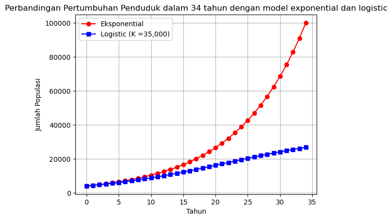

# Population Growth Simulator

Program ini menghitung dan memvisualisasikan **pertumbuhan jumlah penduduk** dalam jangka waktu tertentu menggunakan **model pertumbuhan eksponensial**.

## Deskripsi
Rumus pertumbuhan penduduk yang digunakan adalah:

**P(t) = P₀ · exp(r · t)**

- **P₀** : jumlah penduduk awal  
- **P(t)** : jumlah penduduk setelah t tahun  
- **r** : laju pertumbuhan tahunan  
- **t** : waktu dalam tahun  

Program ini juga dapat menghitung **laju pertumbuhan** r jika jumlah penduduk awal, akhir, dan jumlah tahun diketahui:

**r = (1/t) · ln(Pt / P0)**

## Cara Menggunakan
1. Jalankan program `src/pertumbuhan_penduduk.py`.
2. Masukkan jumlah penduduk awal (`P0`).
3. Masukkan jumlah penduduk setelah beberapa tahun (`Pt`).
4. Masukkan jumlah tahun yang telah lewat (`t`).
5. Program akan menampilkan:
   - Laju pertumbuhan tahunan
   - Jumlah penduduk tiap tahun
   - Grafik pertumbuhan populasi

## Contoh Output


Gambar menampilkan hasil simulasi pertumbuhan populasi rusa Kaibab dengan:

Populasi awal P0 = 4.000 ekor

- Laju pertumbuhan intrinsik r = 0.1

- Kapasitas dukung lingkungan (K) sebesar 100.000 ekor

- Periode waktu simulasi 50 tahun

Grafik memperlihatkan perbandingan pertumbuhan exponential dan logistic (lihat v4.0).


## v2.0
- Pengalihan dari *input()* ke *argparse*
- Membagi program ke 4 modular

## Cara menggunakan:
jalankan command *python src/main.py --tahun (n) --P0 (n) --Pt (n) --mode (n)*

dengan:
--tahun : jumlah tahun (int)

--P0 : populasi awal (int)

--Pt : populasi akhir (int)

--mode : pilih output

1 → Grafik saja

2 → Simpan data (CSV + JSON)

3 → Keduanya (default)


## v3.0
## Testing

Project ini sudah dilengkapi dengan unit test menggunakan **pytest**.  
Tujuan test adalah memastikan fungsi perhitungan, penyimpanan data, dan plotting berjalan sesuai harapan.

## Menjalankan Test
```bash
pytest -v
```
Cakupan
Calculator → hitung laju & populasi

IO Handler → simpan CSV & JSON


Plotter → generate grafik PNG
(Penambahan testing untuk memastikan program berjalan sesuai harapan)

## v4.0

### Model Logistik (Kaibab Deer)

Mulai versi ini, program mendukung simulasi dengan **model pertumbuhan logistik**. Model ini lebih realistis untuk populasi hewan maupun manusia dalam jangka panjang karena adanya batas daya dukung lingkungan (*carrying capacity*).

**Rumus Logistik:**

$$
P(t) = \frac{K}{1 + \left(\frac{K - P_0}{P_0}\right)e^{-rt}}
$$

* **P0** : populasi awal
* **K** : *carrying capacity* (kapasitas dukung lingkungan)
* **r** : laju pertumbuhan intrinsik
* **t** : waktu

### Contoh: Kaibab Deer

* Populasi awal = 4.000 ekor
* Kapasitas dukung (K) = 100.000 ekor
* Laju pertumbuhan = 0.1

Hasil simulasi akan menampilkan grafik pertumbuhan yang mendekati **K** setelah waktu yang cukup panjang.

### Cara Menggunakan

Tambahkan argumen `--model` untuk memilih model pertumbuhan:

```bash
python src/main.py --tahun 50 --P0 4000 --r 0.1 --K 100000 --model logistic
```

Argumen tambahan:

* **--r** : laju pertumbuhan
* **--K** : kapasitas dukung (*carrying capacity*)

Jika **--model** tidak disebutkan, default tetap menggunakan **eksponensial**.

### Output

* Grafik pertumbuhan populasi logistik
* Data populasi tiap tahun (opsional, CSV/JSON jika dipilih)

### Status

Tahap pengembangan untuk GUI dasar dan validasi data lapangan


